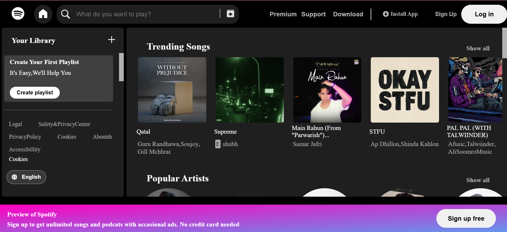
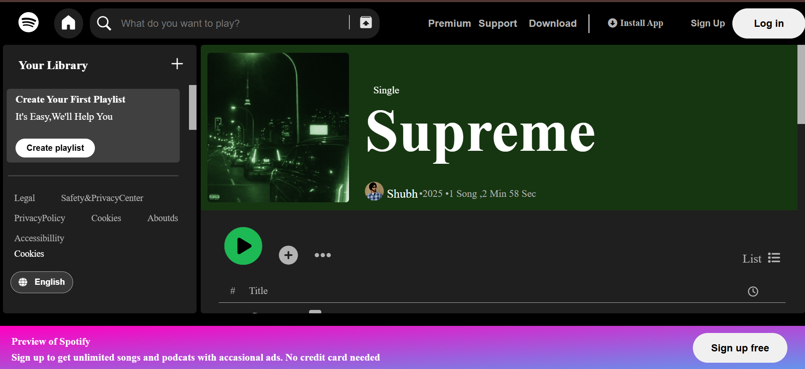

# spotify-clone
A basic Spotify clone using HTML, CSS, JS

---

## Demo

[Live Demo](https://builtbyusman.github.io/spotify-clone)

---
## Screenshots

### Desktop View

## Features

- Basic UI similar to Spotify’s interface
- Play/pause buttons 
- Playlist layout 

---

## Technologies Used

- HTML5
- CSS3 (Flexbox, Grid)
- JavaScript 

---

## How to Use

1. Clone or download this repository.
2. Open `index.html` in your browser.
3. Explore the UI and interactions.

---

